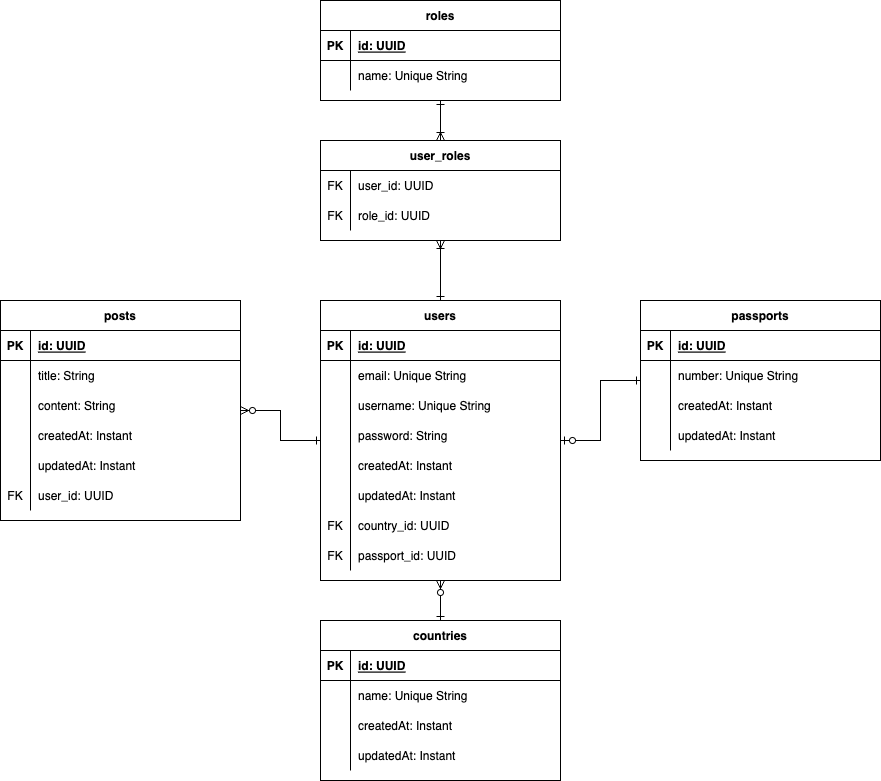

# Spring JPA Demo

Hi! This repository will showcase the use
of [`Java Persistence API (JPA)`](https://docs.spring.io/spring-data/jpa/docs/current/reference/html/) in Spring Boot.

This repository contains one example written in both [`Java`](https://dev.java/learn/)
and [`Kotlin`](https://kotlinlang.org/).

## Use Cases of JPA

The `Spring Java Persistence API (JPA)` is a widely used framework that provides an easy-to-use interface for working
with relational databases. The framework is built on top of the `JPA` specification, which defines a set of interfaces
and annotations for accessing and manipulating data in a relational database.

One of the primary use cases for Spring JPA is building web applications that require persistence. By using Spring JPA,
developers can easily map their domain objects to database tables and perform basic CRUD (create, read, update, delete)
operations. This allows developers to focus on building the application logic rather than worrying about the underlying
database operations.

Another use case for Spring JPA is working with complex database queries. Spring JPA provides a powerful query language
called JPQL (Java Persistence Query Language), which allows developers to write complex queries using familiar Java
syntax. This makes it easy to build custom queries that retrieve data from multiple tables, filter by specific criteria,
and aggregate data in various ways.

In addition to these use cases, Spring JPA also provides support for transactions, caching, and validation. Transactions
ensure that multiple database operations are treated as a single atomic operation, which is important for maintaining
data integrity. Caching can improve application performance by reducing the number of database queries, while validation
ensures that data being stored in the database meets certain criteria.

Overall, Spring JPA is a versatile framework that can be used in a wide range of applications that require persistence.
By providing a simple and powerful interface for working with relational databases, Spring JPA helps developers build
robust and scalable applications with ease.

## Summary of the Project

This demo is purely backend. A `Slidev` presentation is available and contains more information about `JPA`.

### Diagrams

#### Entity Relationship Diagram (ERD)



The image above is the Entity Relationship Diagram (ERD) of this project. There are a total of `6 tables` and they are
the following:
- `users` - contains the user's information
- `posts` - contains the posts of the users, a user can have many posts
- `countries` - contains the countries of the users, a country can have many users
- `roles` - contains the roles of the project
- `user_roles` - contains the linked roles of the user, a user can have many roles
- `passports` - contains the passport information of the user, a user can have one passport

### Features

The following features are implemented for this demo:

#### User

- Registration (`/api/auth/register`)
- Login (`/api/auth/register`)
- View Profile (`/api/user/profile`)
- View Profile of other user (`/api/user/profile/view/{username}`)
- Update Profile TRANSACTIONAL (`/api/user/profile/update`)
- Change Password TRANSACTIONAL (`/api/user/profile/change-password`)

#### Post (Many-to-One)

- Create (`/api/post/create`)
- Get with Pagination, Sorting, and date range (`/api/post/get`)
- Get with Pagination, Sorting, date range, and User ID (`/api/post/get`)
- Update (`/api/post/update/{postId}`)
- Delete (`/api/post/delete/{postId}`)

#### Roles (Many-to-Many)

- Admin (first registered user)
- User (succeeding registered users)

#### Country (One-to-Many)

- Get with Pagination and Sorting (`/api/country/get`)
- Get all users assigned to country with Pagination and Sorting (`/api/country/get/{countryId}`)
- Create (`/api/country/create`)
- Update (`/api/country/update/{countryId}`)
- Assign Country to User (`/api/country/assign`)
- Remove Assigned Country to User (`/api/country/unassign`)
- Delete if not in use (`/api/country/delete`)

#### Passport (One-to-One)

- Create (`/api/passport/create/{userId}`)
- Get Passport with Pagination and Sorting (`/api/passport/get`)
- Get by User ID (`/api/passport/get/{userId}`)
- Update (`/api/passport/update/{passportId}`)
- Delete (`/api/passport/delete/{passportId}`)

### Notes:

- This project has [`Spring Security`](https://docs.spring.io/spring-security/reference/index.html) setup and
  uses [`JSON Web Tokens (JWT)`](https://jwt.io/) for authentication.

## Before You Get Started:

Make sure you have the following prerequisites installed/setup:

- [`Java (17)`](https://dev.java/learn/)
- [`Maven (3.5.4+)`](https://maven.apache.org/)
- [`Docker`](https://www.docker.com/)
    - [`PostgreSQL`](https://hub.docker.com/_/postgres)
- IDE (IntelliJ IDEA, Eclipse, etc.)

### Docker Setup

This project uses `Docker` to set up the database. The following line will install and set up the `PostgreSQL` database.

```bash
docker-compose up
```

### Slidev Setup

## Plans

- Docker Setup
- Spring Boot Setup
- Explain PagingAndSortingRepository
- Explain CrudRepository
- Explain JPARepository
- Explain Features
- Explain Annotations
- Explain Entities
- Explain Services
- Create User Examples
- Create Post Examples
- Relationships
    - One-to-One Relationship
    - One-to-Many Relationship
    - Many-to-Many Relationship
    - Many-to-One Relationship
- Directions
    - Unidirectional
    - Bidirectional
- ID Generation Strategies
    - UUID
    - Identity
- Application Properties
    - Database
    - Hibernate
- List of compatible databases
    - MySQL
    - PostgreSQL
- Pageable for Pagination
- Transactions
- Migrations
    - Auto
    - Manual
- Important of DTOs
    - Mapping
- Other methods
    - Rest
    - GraphQL
- JsonIgnores
- Fetch Types
    - Lazy
    - Eager
- Cascade Types
    - All
    - Merge
    - Persist
    - Refresh
    - Remove
    - Detach
- Query
    - Method
    - Language
- Versioning of APIs

## TODO

- [ ] Slidev Presentation
- [ ] Diagrams
    - [ ] Process Flow
    - [ ] Entity Relationship Diagram

### Others

- [ ] Add more documentation
- [ ] Unit Testing

## References

- [Spring Java Persistence API](https://docs.spring.io/spring-data/jpa/docs/current/reference/html/)
- [Java 17](https://dev.java/learn/)
- [Kotlin](https://kotlinlang.org/)
- [Maven 3.5.4+](https://maven.apache.org/)
- [Docker](https://www.docker.com/)
- [Spring Security](https://docs.spring.io/spring-security/reference/index.html)
- [JWT](https://jwt.io/)
- [PostgreSQL](https://hub.docker.com/_/postgres)
- [Use Spring Data CrudRepository for database access](https://kotlinlang.org/docs/jvm-spring-boot-using-crudrepository.html)
- [Working with Kotlin and JPA](https://www.baeldung.com/kotlin/jpa)